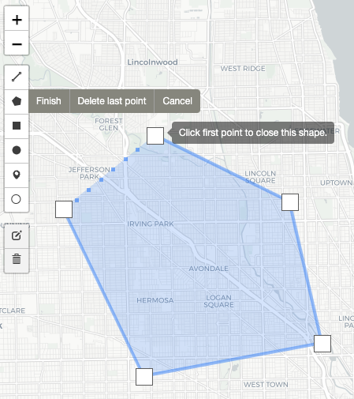
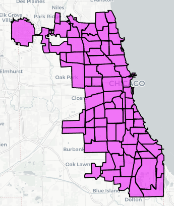

# Web-Based Visualisation System for Divvy Data Analysis

## 🔗 Quick Links

- [Observable Testing Collection](https://observablehq.com/collection/@rakaprimardika/cs-424-project-3) to practice making the plots without worrying about HTML placement.
- [React Tutorials and Documentation](https://reactjs.org/)
- [Leaflet Index Page](https://leafletjs.com/index.html)
- [Leaflet Basic Shapes](https://www.igismap.com/leafletjs-point-polyline-polygon-rectangle-circle/)

## 🗒️ Sketches

Sketches can be found in the `sketches/` folder.

Concept is to have several _modes_ of plots. We propose to have three modes: brush mode, slider mode and select mode.

| Brush Mode | Slider Mode | Select Mode |
| :----------: | :-----------: | :-----------: |
|  |  |  |
| _Brush mode_ concept is shown in [V4](sketches/webpage-design-v04.png). It is our linked view line plot from P2, where the interaction is from brushing points on the map. | _Slider mode_ concept is shown in [V5](sketches/webpage-design-v05.png). It is our single view scatterplot from P2, where the interaction is from using a slider. In this project, we propose to add a **new linked** _flow map_. | _Select mode_ concept is shown in [V6](sketches/webpage-design-v06.png). It allows interaction of selecting parts of the pie chart. The selected data is represented in the **new** heat map and the **new** bar chart. |
| _map scatter plot (spatial, linked, interact)_, _line chart (linked)_ | slider (interact), _scatter plot (linked)_, _flow map (spatial, linked)_ | _pie chart (interact, linked)_, _heat map (spatial, linked)_, _bar chart (linked)_ |

## 🏞️ Leaflet Concepts

For each mode, we propose to use the following Leaflet functionalities:

| Brush Mode | Slider Mode | Select Mode |
| :----------: | :-----------: | :-----------: |
| Leaflet Draw | Lines? | External GeoJSON |
|  | TBD |  |
| We should probably restrict to only one drawing tool. Using all of the tools would be overkill. | TBD | Tracts proved to be too small, but might be useful should we choose to have a zooming functionality. |

## 👥 Group Members

Raka Primardika (aprima3@uic.edu), Khanh Duy Nguyen (knguye71@uic.edu)

## 👨🏻‍🏫 Note to Grader/Instructor

Our domain/data questions, analyses, reasonings can be found in the [💬 Summary](#💬-summary) section below.

We are using _<insert here>_ to host our web page.

## 💼 Portofolio Notes

This project was done under a duration of 3 weeks, presented on _TBD_. This is the final version/continuation of previous projects. For this class (CS 424), we did two projects already: [Project 1](https://github.com/uic-vis/project-1-raka-s-team) (September 2022) and [Project 2](https://github.com/uic-vis/project-2-raka-s-team) (October 2022).

_Note: both project repositories are private._

In both previous projects, plus this one, we are analysing data from _Divvy_, a bikeshare service in Chicago, IL, USA.

In Project 1, we practiced simple visualisations using Python. In Project 2, we familiarised ourselves with interactive visualisations using JavaScript and D3 on [Observable](https://observablehq.com/). In this final project, we are making a full website that hosts all of our previous visualisations, plus some new ones.

## 🔖 Project Description

Can be found on this [direct link](https://fmiranda.me/courses/cs424-fall-2022/project-3/), or from the course [website](https://fmiranda.me/courses/cs424-fall-2022/).

## 📝 Tasks/Checklist

### Tasks

- [x] Choose a _web hosting service_. Most Likely **GitHub Pages**.
- [x] Sketch a design plan for the website.
- [ ] Create an empty website with various components.
- [ ] JavaScript code to load in data.
- [ ] Visualisation Requirements:
  - [ ] _Two_ interactive visualisations from _Project 2_.
  - [ ] _New_ multiple linked view visualisationusing a _different_ interaction mechanism.
  - [ ] _New_ spatial view visualisation. Recommended: link to other visualisations.

### Deliverables

- [ ] This markdown document.
- [ ] Source code and data files.
- [ ] Screenshot (`.png`) of visualisation interface.
- [ ] _Link_ to a web page hosting our interface.
- [ ] Presentation **without** slides. Present web page interface live.

## 💬 Summary

### Background

We are analysing data from Divvy bicycle rideshare service in Chicago, IL, USA. For this project, we are analysing data from the last week of October 2022 (_24/10/2022 - 30/10/2022_). We limit ourselves to this for the purpose of efficiency. We believe that this is still sufficient data to derive meaningful knowledge and would be very good practice on designing a working visualisation interface.

### Domain Questions

From our [previous project](https://github.com/uic-vis/project-2-raka-s-team), we have already compiled a set of exploratory questions:

- Q01: Do paid members use more e-bikes than non-paid users?
- Q02: At which times of the day do UIC students use Divvy bikes the most?
- Q03: Do people ride faster and farther in the afternoon compared to morning time?

In this project, we would like to explore new inquiries, relevant to the ones fom the previous project.

- Q04: Do most people ride towards the city centre in the mornings and away in afternoons?
- Q05: Which communities have more Divvy members than casual riders?

**Q04** was inspired from the previous findings of **Q03**. We showed that there are more rides in the afternoon compared to morning time. We want to extend this to analyse the spatial ements of this inquiry. Among those morning and afternoon rides, we believe that most of the morning rides are people going to work, to the city centre. Afternoon rides (which are more popular) are ones where people will go away from the city centre.

**Q05** explores our thoughts on the socio-economic aspect of Divvy users. We think that the communities which are higher up in the socio-economic ladder have more people who are Divvy members (who subscribe to the $120/year fee). We wanted to know if this is true, hoping to create a ranking of the communities' divvy membership rates. This inquiry is an extension from the results of **Q01**.

### Dataset Description

TODO: Mention columns, attribute types, etc.

Don't forget this now... 🤦‍♂️

### Data Questions

- QXX: How do _e-bike and normal bike ridership_ ratios differ for each _membership type_?
- QXX: Given a _region_ in Chicago, how does the _number of all Divvy rides_ change for each _hour of the day_?
- QXX: Given a _time of the day_, how do _distance_ and _duration_ of trips compare for both _types of bikes_?

### Interface Design

### Plot Choices

### Analysis and Findings

### Future Work

## References

- [Divvy Data](https://divvy-tripdata.s3.amazonaws.com/index.html)
- [Leaflet Draw Library Links](https://cdnjs.com/libraries/leaflet.draw)
