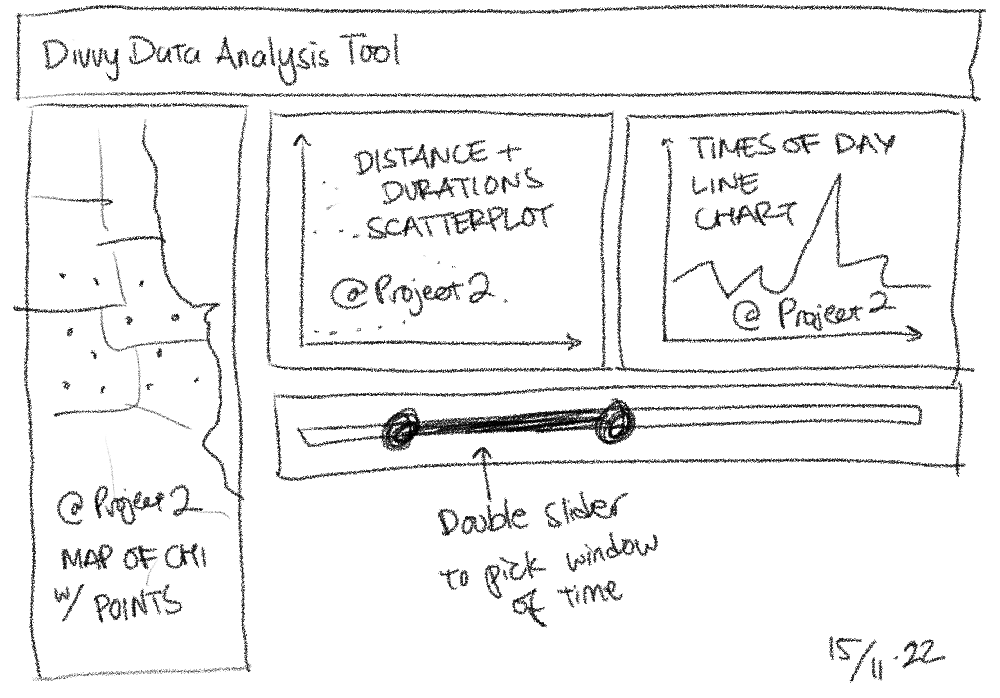
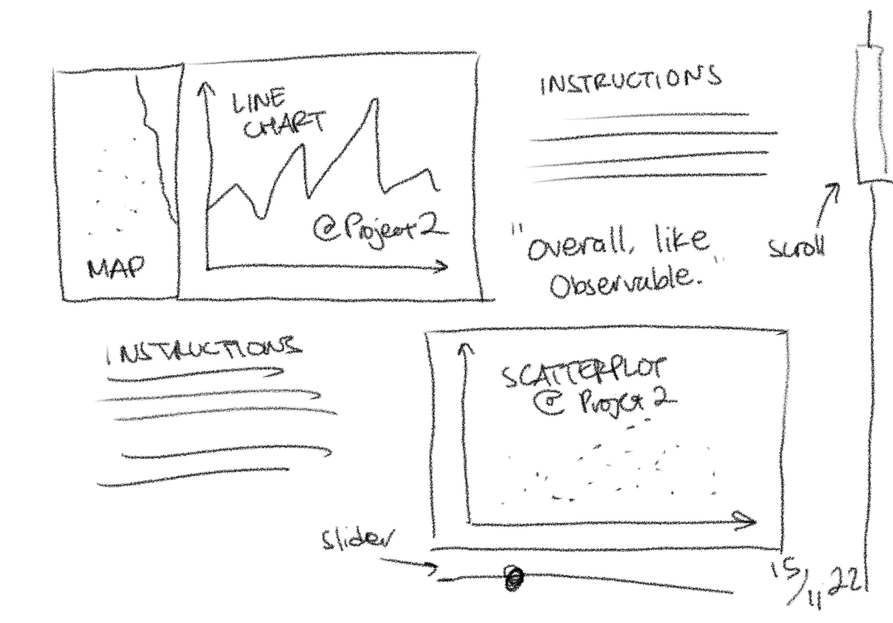
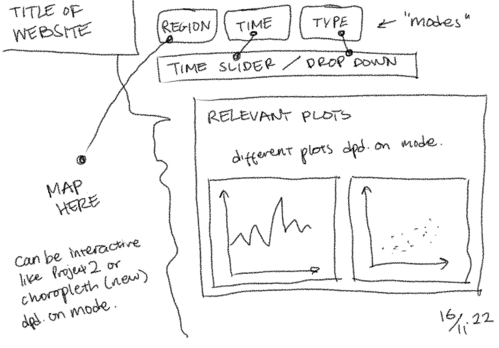

# Web-Based Visualisation System for Divvy Data Analysis

## 🗒️ Sketches

I guess our first task is to figure out an ideal layout for our web page. Two basic concepts I thought of, but happy to deviate from.

**V1**. Condense our Project 2 plots such that all viewable without scrolling, somehow.

**V2**. Tell a story about the plots, from top to bottom, showcasing all plots with scrolling.

**V3**. Interface based on "modes", where the map/slider/drop-down gets enabled/disabled depending on the mode.

## 👥 Group Members

Raka Primardika (aprima3@uic.edu), Khanh Duy Nguyen (knguye71@uic.edu)

## 👨🏻‍🏫 Note to Grader/Instructor

Our domain/data queations, analyses, reasonings can be found in the [💬 Summary](#💬-summary) section below.

We are using _<insert here>_ to host our web page.

## 💼 Portofolio Notes

This project was done under a duration of 3 weeks, presented on _TBD_. This is the final version/continuation of previous projects. For this class (CS 424), we did two projects already: [Project 1](https://github.com/uic-vis/project-1-raka-s-team) (September 2022) and [Project 2](https://github.com/uic-vis/project-2-raka-s-team) (October 2022).

_Note: both project repositories are private._

In both previous projects, plus this one, we are analysing data from _Divvy_, a bikeshare service in Chicago, IL, USA.

In Project 1, we practiced simple visualisations using Python. In Project 2, we familiarised ourselves with interactive visualisations using JavaScript and D3 on [Observable](https://observablehq.com/). In this final project, we are making a full website that hosts all of our previous visualisations, plus some new ones.

## 🔖 Project Description

Can be found on this [direct link](https://fmiranda.me/courses/cs424-fall-2022/project-3/), or from the course [website](https://fmiranda.me/courses/cs424-fall-2022/).

## 📝 Tasks/Checklist

### Tasks

- [ ] Choose a _web hosting service_.
- [ ] Sketch a design plan for the website.
- [ ] Create an empty website with various components.
- [ ] JavaScript code to load in data.
- [ ] Visualisation Requirements:
  - [ ] _Two_ interactive visualisations from _Project 2_.
  - [ ] _New_ multiple linked view visualisationusing a _different_ interaction mechanism.
  - [ ] _New_ spatial view visualisation. Recommended: link to other visualisations.
  
### Deliverables

- [ ] This markdown document.
- [ ] Source code and data files.
- [ ] Screenshot (`.png`) of visualisation interface.
- [ ] _Link_ to a web page hosting our interface.
- [ ] Presentation **without** slides. Present web page interface live.

## 💬 Summary

_TODO: Add summary here_
