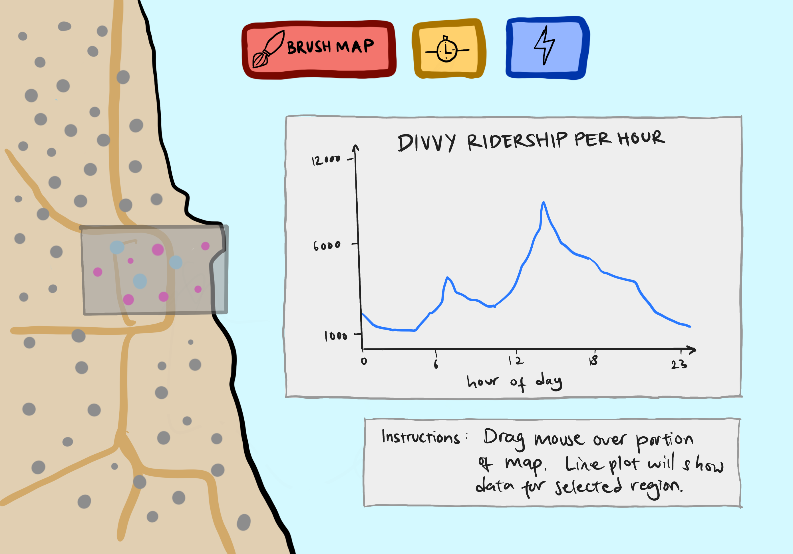
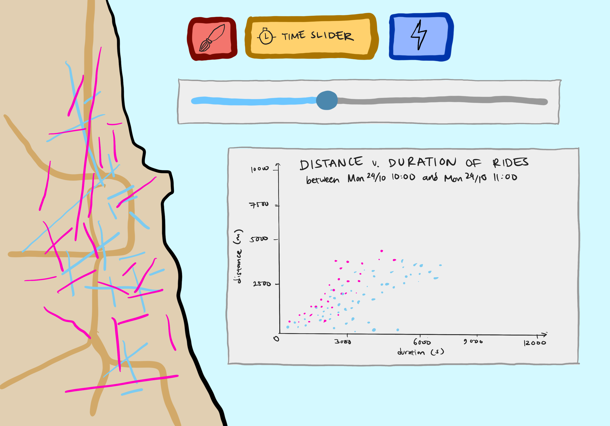
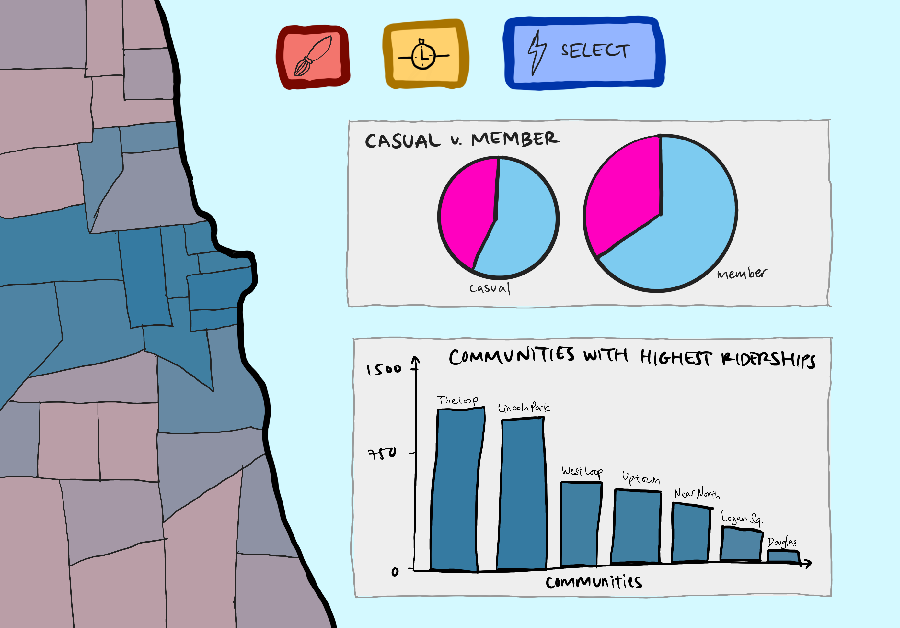
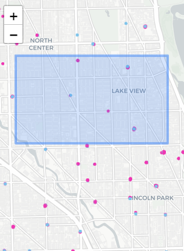
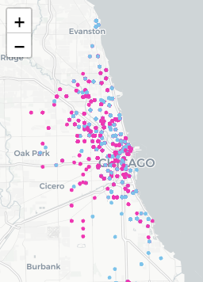
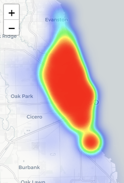
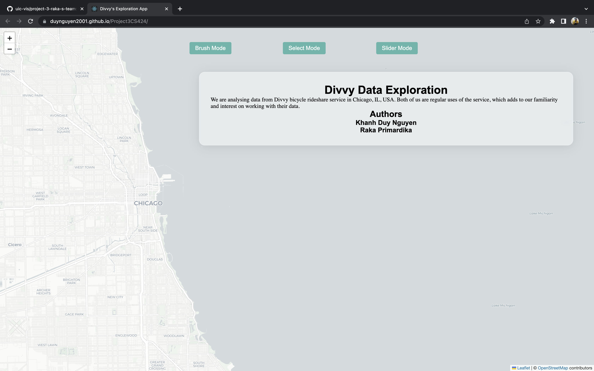
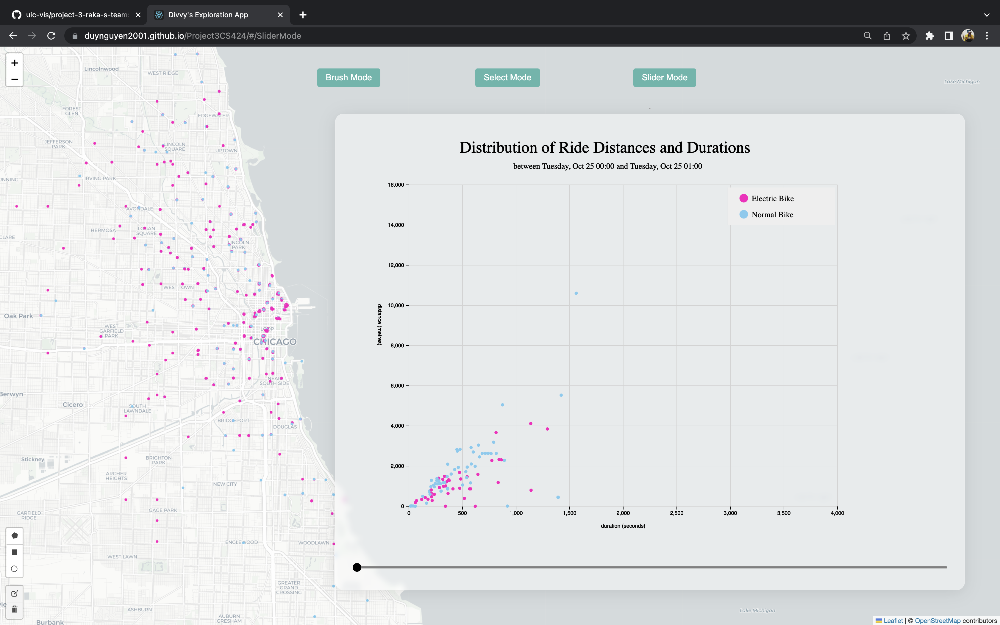
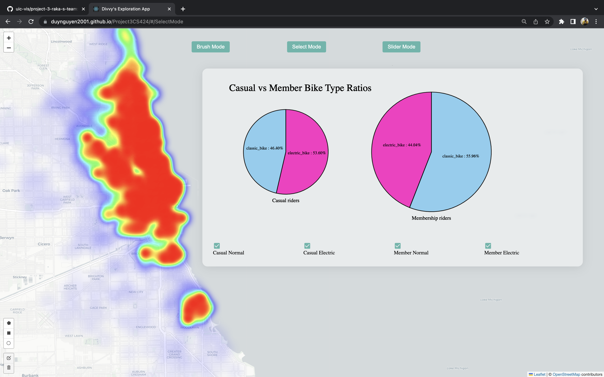
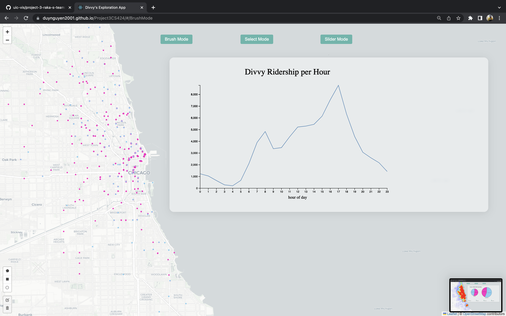

# Web-Based Visualisation System for Divvy Data Analysis

## 🌎 Webpage Link

- [Our Webpage](https://duynguyen2001.github.io/Project3CS424/), hosted with **GitHub Pages**

## 🧾 Logistics

### Group Members

Raka Primardika (aprima3@uic.edu), Khanh Duy Nguyen (knguye71@uic.edu)

### Organisation

University of Illinois at Chicago, CS 424: Visualisation and Visual Analytics, Project 3

Project description can be found on this [direct link](https://fmiranda.me/courses/cs424-fall-2022/project-3/), or from the course [website](https://fmiranda.me/courses/cs424-fall-2022/).

## 🏞️ Background

We are analysing data from Divvy bicycle rideshare service in Chicago, IL, USA. Both of us are regular uses of the service, which adds to our familiarity and interest on working with their data.

## 📊 Dataset Description

The dataset we are handling spans from 24/10/2022 through 30/10/2022, which is only one week of data. This is _~85000_ rows. We believe that even though this is little, it's still sufficient to gather meaningful knowledge from the visualisations created from the data. We wanted to at least make sure we get all the days in the week, so that we can compare between the days.

_Note:_ Data was preprocessed using python. Code for this can be found under the `python/` folder.

The dataset contains various information: start and end time, start and end coordinates, member types, bike types, station IDs and ride IDs. We are most interested in the spatiotemporal data, combining them with the bike and member type data to produce meaningful plots.

## 🗒️ Initial Plans and Sketches

Sketches can be found in the `sketches/` folder.

In our initial discussions, we wanted to have several modes of web pages, separated by the types of interaction.

| Sketch | Description |
| :---: | :----: |
|  | This is our initial concept for our webpage. We are to switch between plots depending on the _mode_, selected by using the buttons on top of the page. In all modes, the full map will be shown as the background. Overlays of the map will change depending on the mode. |

Upon discussing, we eventually aggred to have three modes: brush mode, slider mode and select mode. This is our initial plan. Depending on our progress, this may change.

| Brush Mode | Slider Mode | Select Mode |
| :----------: | :-----------: | :-----------: |
|  |  |  |
| _Brush mode_ is our linked view line plot from P2, where the interaction is from brushing points on the map. | _Slider mode_ is our single view scatterplot from P2, where the interaction is from using a slider. In this project, we propose to add a **new linked** _flow map_. | _Select mode_ allows interaction of selecting parts of the pie chart. The selected data is represented in the **new** heat map and the **new** bar chart. |
| _map scatter plot (spatial, linked, interact)_, _line chart (linked)_ | slider (interact), _scatter plot (linked)_, _flow map (spatial, linked)_ | _pie chart (interact, linked)_, _heat map (spatial, linked)_, _bar chart (linked)_ |

## 👷🏻‍♂️ Initial Work

For this project, we are deciding to use [React](https://reactjs.org/) to build our website.

## 🍂 Leaflet Concepts

For each mode, we propose to use the following Leaflet functionalities:

| Brush Mode | Slider Mode | Select Mode |
| :----------: | :-----------: | :-----------: |
| Leaflet Draw | Leaflet Circles | Leaflet Heatmap |
|  |  |  |
| Use the _polygon_ and _rectangle_ drawing tools. | Display the same points as in _Brush Mode_. | Density visualisation using [Leaflet Heatmap](https://github.com/Leaflet/Leaflet.heat) |

## 📸 Screenshots

| Home | Slider Mode |
| :--------: | :---------: |
|  |  |
| **Select Mode** | **Brush mode** | 
|  |  |

## References

- [Divvy Data](https://divvy-tripdata.s3.amazonaws.com/index.html)
- [Leaflet Draw Library Links](https://cdnjs.com/libraries/leaflet.draw)
- [React Tutorials and Documentation](https://reactjs.org/)
- [Leaflet Index Page](https://leafletjs.com/index.html)
- [Leaflet Basic Shapes](https://www.igismap.com/leafletjs-point-polyline-polygon-rectangle-circle/)
- [Leaflet Heatmap](https://github.com/Leaflet/Leaflet.heat)